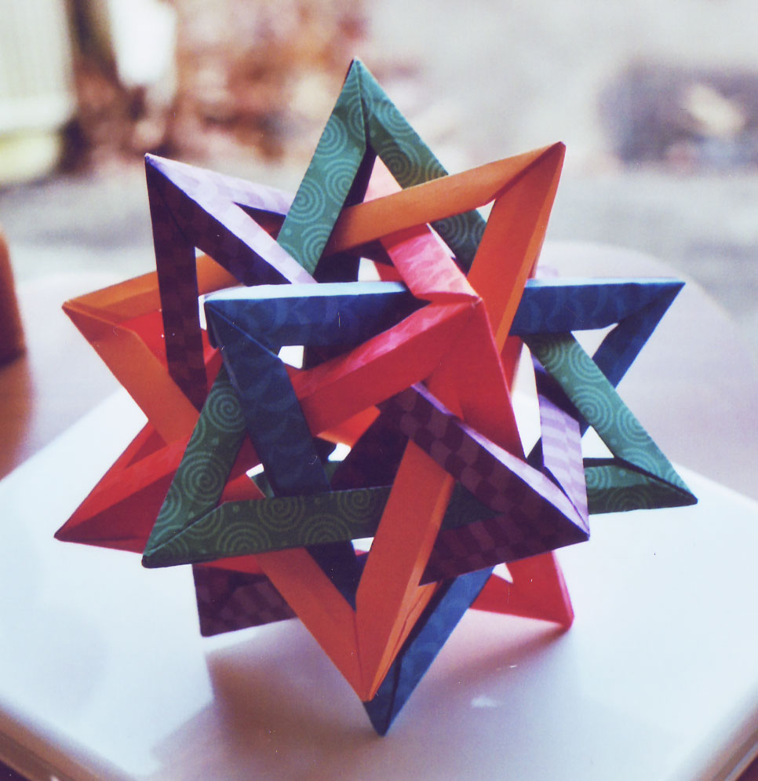
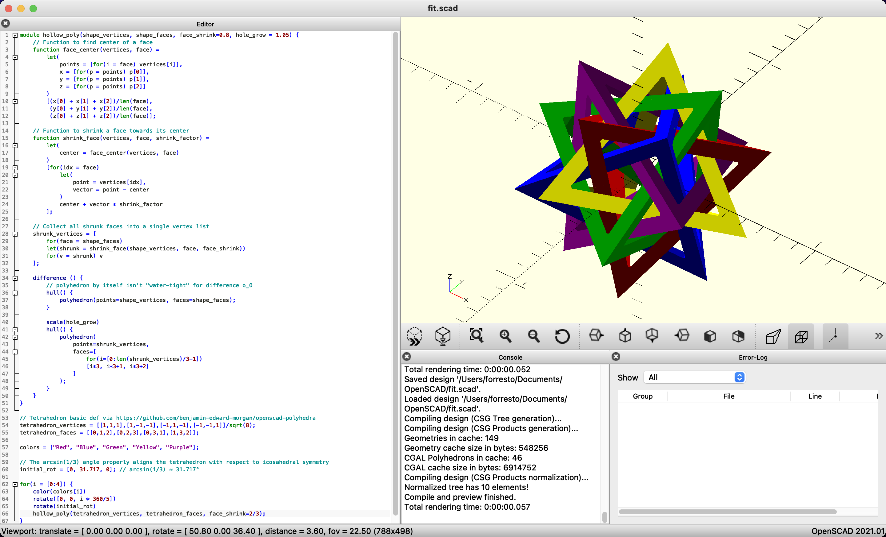

During [Fab Academy](/fab-academy/) I remembered the modular origami puzzle known as FIT, _Five Intersecting Tetrahedra_. 



I made one [20 years ago](https://flickr.com/photos/forresto/2647342483/in/album-191297), and thought it would be fun to revisit. The directions that I found [from Thomas Hull](http://origametry.net/fit.html) were the same ones that I used back then. They are a bit like

1. Construct the first tetrahedron.
2. Construct the second tetrahedron linked to the first.
3. ✨ _(Then a miracle occurs.)_ ✨
4. Now you have a FIT!

I tease. It's a really hard puzzle to describe with words and 2D diagrams. [Michał Kosmulski's FIT directions](https://www.origami.kosmulski.org/instructions/fit-five-intersecting-tetrahedra-tom-hull) add some helpful details.

# Construction

One thing that I thought would help future FIT folders is 3D diagrams of each step that can be rotated. So I made some. 

You can drag to look around these models.

## Step 1

<script type="module" src="/js/model-viewer.min.js"></script>
<model-viewer src="fit/fit-1.glb" ar ar-modes="webxr scene-viewer quick-look" camera-controls tone-mapping="neutral" shadow-intensity="1">
</model-viewer>

## Step 2

<model-viewer src="fit/fit-2.glb" ar ar-modes="webxr scene-viewer quick-look" camera-controls tone-mapping="neutral" shadow-intensity="1">
</model-viewer>

Spin this until you see something like a star of David. ✡

> The corner of the red tetrahedron is poking through a "hole" of the purple one, and vice-versa, the corner of the purple tetrahedron is poking throught a "hole" of the red one.

This relationship ends up being true of every pair of tetrahedra, once finished.

## Step 3

<model-viewer src="fit/fit-3.glb" ar ar-modes="webxr scene-viewer quick-look" camera-controls tone-mapping="neutral" shadow-intensity="1">
</model-viewer>

This one is key. Once you get the third one integrated correctly, the next two are easier.

## Step 4

<model-viewer src="fit/fit-4.glb" ar ar-modes="webxr scene-viewer quick-look" camera-controls tone-mapping="neutral" shadow-intensity="1">
</model-viewer>

## Step 5

<model-viewer src="fit/fit-5.glb" ar ar-modes="webxr scene-viewer quick-look" camera-controls tone-mapping="neutral" shadow-intensity="1">
</model-viewer>

# OpenSCAD modeling

This model was created in OpenSCAD, one of the CAD packages that I didn't [evaluate last week](/fab-academy/02-cad-comparison.md). 



Here's the code. This was made with help from Claude 3.5 Sonnet via Zed, and [took a lot of back and forth to get right](/oldsite/ai/fit-claude-chat.md).

<details><summary>OpenSCAD code to draw Five Intersecting Tetrahedra</summary>

```js
module hollow_poly(shape_vertices, shape_faces, face_shrink=0.8, hole_grow = 1.05) {
    // Function to find center of a face
    function face_center(vertices, face) = 
        let(
            points = [for(i = face) vertices[i]],
            x = [for(p = points) p[0]],
            y = [for(p = points) p[1]],
            z = [for(p = points) p[2]]
        )
        [(x[0] + x[1] + x[2])/len(face), 
         (y[0] + y[1] + y[2])/len(face), 
         (z[0] + z[1] + z[2])/len(face)];
    
    // Function to shrink a face towards its center
    function shrink_face(vertices, face, shrink_factor) = 
        let(
            center = face_center(vertices, face)
        )
        [for(idx = face)
            let(
                point = vertices[idx],
                vector = point - center
            )
            center + vector * shrink_factor
        ];
    
    // Collect all shrunk faces into a single vertex list
    shrunk_vertices = [
        for(face = shape_faces)
        let(shrunk = shrink_face(shape_vertices, face, face_shrink))
        for(v = shrunk) v
    ];
        
    difference () {
        // polyhedron by itself isn't "water-tight" for difference o_O
        hull() {
            polyhedron(points=shape_vertices, faces=shape_faces);
        }
        
        scale(hole_grow)
        hull() {
            polyhedron(
                points=shrunk_vertices,
                faces=[
                    for(i=[0:len(shrunk_vertices)/3-1])
                    [i*3, i*3+1, i*3+2]
                ]
            );
        }
    }
}

// Tetrahedron basic def via https://github.com/benjamin-edward-morgan/openscad-polyhedra
tetrahedron_vertices = [[1,1,1],[1,-1,-1],[-1,1,-1],[-1,-1,1]]/sqrt(8);
tetrahedron_faces = [[0,1,2],[0,2,3],[0,3,1],[1,3,2]];

colors = ["Red", "Blue", "Green", "Yellow", "Purple"];

// The arcsin(1/3) angle properly aligns the tetrahedron with respect to icosahedral symmetry
initial_rot = [0, 31.717, 0]; // arcsin(1/3) ≈ 31.717°

for(i = [0:4]) {
    color(colors[i])
    rotate([0, 0, i * 360/5])
    rotate(initial_rot)
    hollow_poly(tetrahedron_vertices, tetrahedron_faces, face_shrink=2/3);
}
```

One OpenSCAD gotcha took a while to figure out. The tetrahedron defined by

```js
tetrahedron_vertices = [[1,1,1],[1,-1,-1],[-1,1,-1],[-1,-1,1]]/sqrt(8);
tetrahedron_faces = [[0,1,2],[0,2,3],[0,3,1],[1,3,2]];
polyhedron(points=shape_vertices, faces=shape_faces);
```

does not work as the base shape in the `difference` boolean. I had to wrap it with `hull` to repair something invisible.

</details>

# Blender exporting


I then exported STL from OpenSCAD, imported that into Blender, split the object into five objects, added color materials, and exported the five steps as GLB files. 😅

The colors were chosen from [Steph Ango's Flexoki color scheme](https://stephango.com/flexoki). 

For another parametric model, see [Kukan Kogei's effort with Blender Sverchok](https://asahidari.hatenablog.com/entry/2020/11/28/231433).

# Conclusion, files

* [fit-forresto-2025.scad](fit/fit-forresto-2025.scad) – OpenSCAD file
* [fit-forresto-2025.blend](fit/fit-forresto-2025.blend) – Blender file

I'm happy to have my own `fit.html` post on the WWW. Maybe I'll find it in 20 years when I think about folding a FIT again.
