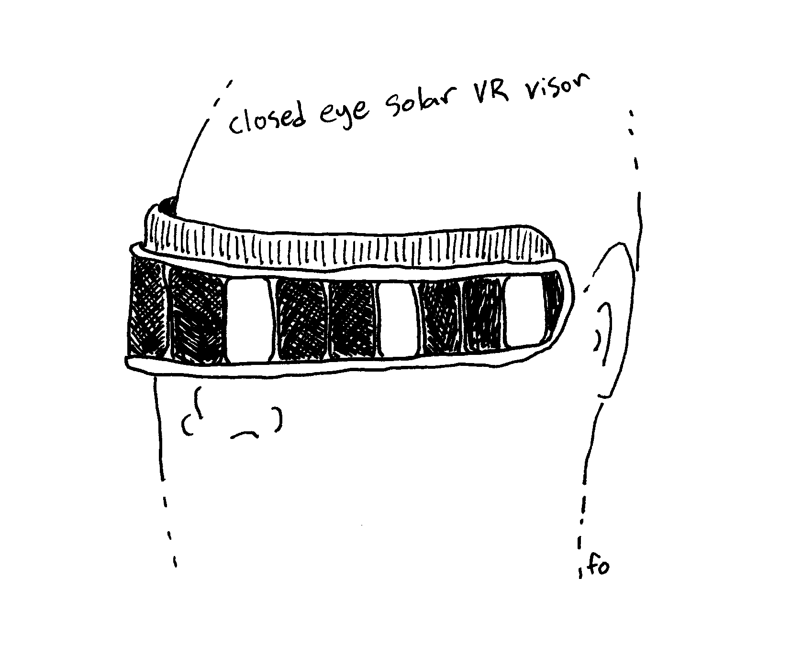

I've been floating the idea for friends and family to imagine the project that I'm going to be making this year, and tell me their thoughts on it. It's a half joke, but wouldn't it be neat if you could do that? I imagine people with a big audience can do that, but there's a fine line between having no replies and having too many.

In the real world, I have to share some sketches, and get more specific when asking for feedback.

I have three concepts now.

# Calm Timer

Plays a nice-sounding chime on the hour, or set intervals with a small screen.

# Tangible Media Player

A collection of wood tokens start a playlist when set on the player. The tokens bring back some tangibility to the act of choosing and playing music. They can also load internet radio stations.

I remember finding a "record player" made in preschool with paper plate, pipe cleaner, buttons. If I choose this project I'll be honoring my small self that really wanted a cool little tangible music player.

## Prior art

* Månsteri's [Äänimuseo](https://mansteri.com/works/aanimuseo-v/) tangible sound player.

# Closed-Eye VR

Closed-eye solar-powered VR visor. With eyes closed, chill in the sun light or with a bright lamp. An array of _liquid crystal_ (LC) cells are activated at different intervals, giving the illusion of motion.

I like how this concept would need a tiny fraction of the energy needed for high-end virtual reality systems. The challenge of programming small low-energy microcontrollers is interesting.

## Prior art

* Brion Gysin [Dreamachine](https://en.wikipedia.org/wiki/Dreamachine) (1959)
* [Geordi LaForge's VISOR](https://en.wikipedia.org/wiki/Geordi_La_Forge#VISOR) is an obvious style inspiration.
* Mitch Altman's [Neuro Dreamer](https://cornfieldelectronics.com/neurodreamer/buy.nd.php) flashes lights into your dreams to help you lucid dream.
* [Active shutter 3D glasses](https://en.wikipedia.org/wiki/Active_shutter_3D_system) could be a source of _liquid crystal cell_ components, though smaller would be better to fit more.
* [Auto Darkening Welding Helmet](https://weldingpros.net/how-do-auto-darkening-welding-helmets-work/) forehead-sized solar panel is enough to darken this style of welding mask, so I think it's feasible, if I can keep the electronics efficient enough.
