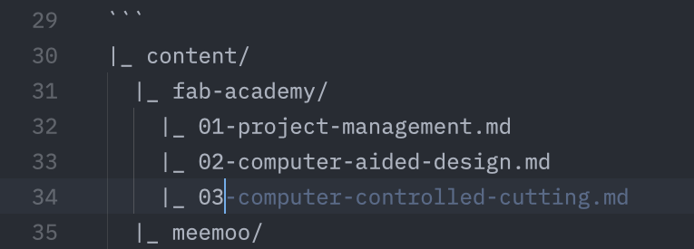

[This week's goals](https://fabacademy.org/2025/nueval/principles_and_practices,_project_management.html)

# Principles and Practices

- [ ] Plan and sketch a [potential final project](01-potential-final-project.md)

# Project Management

- [x] Read, sign (add your name to) the student agreement and commit it to your repo
- [x] Work through a git tutorial.
- [x] Build a personal website in the class archive describing yourself and your final project.
- [ ] Upload parts 1 and 2, to the class archive.

I've done enough git in [my day job](https://cuttle.xyz/about-us) to stay out of trouble. So I took this assignment as an opportunity to restructure my personal website, which I have neglected for some years.

I have a few concepts for how I'd like this site to work.

## File Layout

The source of the site has a simple directory structure, that gets directly translated to the built site's structure. Top level directories are collections, where each post can go. Media for related posts can be named with the same prefix. The prefix can be a number, date, or a bare name, depending on the kind of post.

```txt
|_ content/
  |_ fab-academy/
    |_ index.md
    |_ 01-project-management.md
    |_ 01-related-image.png
    |_ 02-computer-aided-design.md
    |_ ...
  |_ meemoo/
  |_ 2020s/
  |_ ...
```

Posts that don't have an obvious collection go in a "2020s" directory. I have old blog posts and letters back to the 90s that can fit with this structure.

[Tags](/tags) bridge posts across collections.

## Copyright

Kris suggested that I look into

* [robots.txt](https://en.wikipedia.org/wiki/Robots.txt) for search engines and web crawlers like the [Internet Archive](https://web.archive.org/web/*/forresto.com)
* [AI list for robots.txt](https://github.com/ai-robots-txt/ai.robots.txt) to prevent AI scraping and training
* [Creative Commons](https://creativecommons.org/) for choosing a license

The lines between these are blurry to me. If my posts get scraped, archived, and trained on, is that not a (very fuzzy statistical) form of immortality? Can my weird ideas bend the weights of models that will be used to make decisions in the future?

I've admired Creative Commons for a long time, and it would make me happy for humans to use and remix my work. I appreciate attribution, so encoding that into my copyright notice makes sense. If people or AI companies ignore that request, then there's not much I can do about it, other than not publish.

## Publishing

My plan is to copy the HTML output of my own site's "fab-academy" output directory to my Fab Academy repo. (I could simlink just this directory, in order to build a partial version of the site there. I'll decide if that's worth it later.)

## To do

- [ ] Move more recent projects to the personal site collections.
- [ ] Render home and archive post lists with thumbnail images. Make it more visual.

# Credit

## Eleventy static site generator

To build this new site, I started with the [Eleventy Base Blog v9](https://github.com/11ty/eleventy-base-blog). I considered other static site generators, but I ended up having more opinions than the simpler "opinionated" options allow.

I like that the base blog comes with the [eleventy-img](https://www.11ty.dev/docs/plugins/image/) plugin set up and configured. With that my source Markdown can be simply:

```markdown

```

Which becomes fancy HTML:

```html
<picture>
	<source type="image/avif" srcset="studio-wall-1280-1100.avif">
	<source type="image/webp" srcset="studio-wall-1280-1100.webp">
	
</picture>
```

While the site is building, the plugin measures the source image and makes variants with different file types. By including the `width` and `height` attributes, the layout will not shift as the page content loads. By including alternate file types, the browser can choose the best one for the user's device and network conditions.

This seems like a perfect division.
* the "source of truth" that I take care of
* the "published artifact" that the build process takes care of

I have not seen the same flow for videos, but it should be possible.

There was a bug with how I set up the "posts" collection, so [I reported the bug to Eleventy](https://github.com/11ty/eleventy/issues/3630), and hopefully that will help, at least to clarify the docs as to what might be going on.

## AI Use

I like that Fab Academy is stressing that use of AI should be documented. To give credit to the model and prompt that you use to generate work seems like a good practice.

I use [Zed editor](https://zed.dev) to write posts and hack on the site templates and configuration. It comes with a version of Claude 3.5 Sonnet that you can chat with. The user experience is between chat and collaborative document. You have to choose which open tabs go into the chat context. I like that the control that this gives, and I like that I can roll back in the chat and delete some back and forth if we're going off the rails.

And it does go off the rails. Hallucination is how it works, so the text that it generates can't ever be fully trusted. Eleventy is a long-lived project, which is good because Calude knows about it. It can also be annoying, when it repeats suggestions that I've learned are from earlier versions, that can use broken or deprecated features.

> (I haven't tried downloading the [Eleventy documentation source Markdown files](https://github.com/11ty/11ty-website/tree/main/src/docs) for the version that I'm using and putting that in the context. That might be too many tokens. Could be worth trying.)

Ultimately, I think it's a good [rubber duck](https://en.wikipedia.org/wiki/Rubber_duck_debugging) partner. Except a talkative BS-ing confident rubber duck. That can sometimes be helpful.

Here is an example of one of the prompts that I reused to provide context in several sessions.

<blockquote>

here is the structure of my 11ty site content:

```
/dir-1/
|_ index.md
|_ post-1.md
|_ post-2.md
/dir-2/
|_ post-3.md
|_ post-4.md
```

On the "archive" page, I want a list of the directories, and count of posts per directory.

On each directory page, I want the content of index.md (optional) and a list of the posts.

</blockquote>

While writing this post, I noticed that the inline code completions know about Fab Academy's weeks.



Did it surmise this from the text checklist in [index.md](../)? Either that or it knows this from training, which seems possible, given how much documentation exists over the years for Fab Academy.

# Fab Academy Feedback

The importance of resizing images before committing has been stressed a bunch, taking up time in the lectures and spaces in the chat. But I think that concern is a bit outdated. If we have to decide between time spent documenting, and time spent wrangling media files... Let the machines do the media busy work!

My new website setup isn't ideal. There is more friction to doing documentation than my Notion [Blender Learning jounal](https://fopub.notion.site/2942db42f3d14348b382696c0296971d?v=ccfdc55d9fc347f4bf8661aa22f43c8c). But I think it's a step in right direction that I only need to manage Markdown and media files, and the build process takes care of indexing and image sizing and formats. And the static HTML output loads and renders quickly. ⚡️
