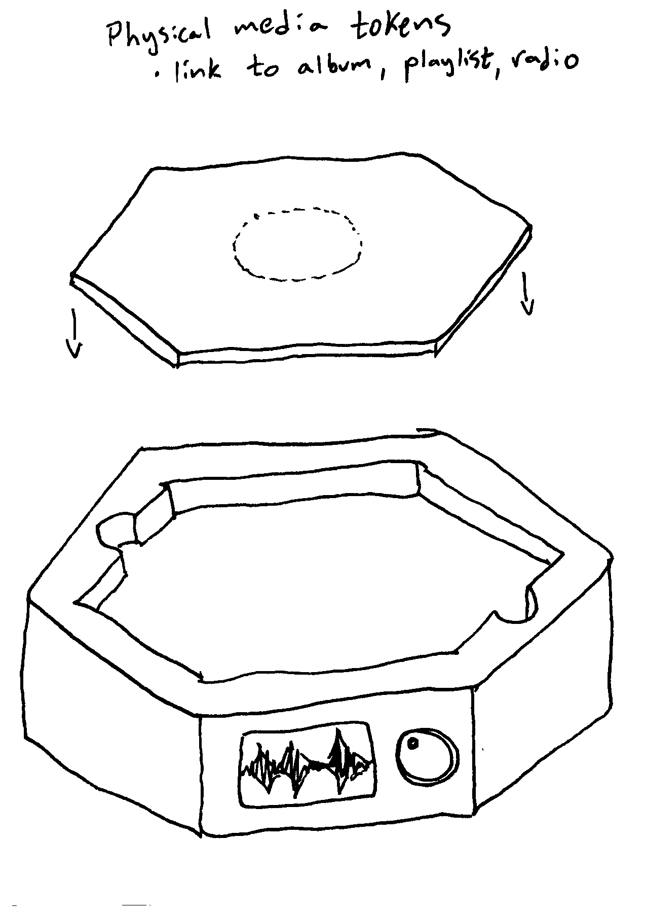
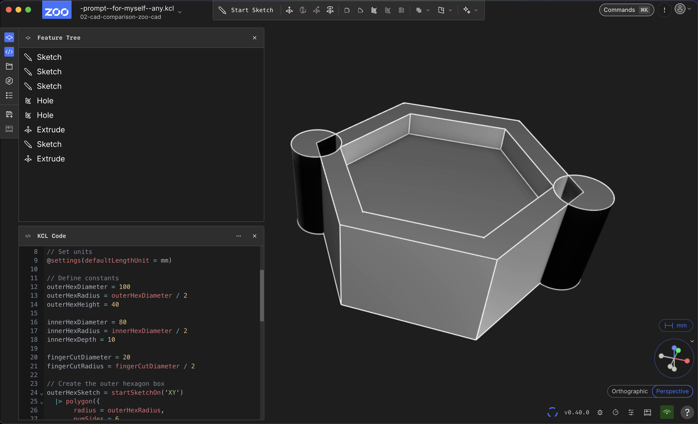

My goal for this CAD Comparison week should be to get a very rough model from each system that I try. As possible, it should have ballpark dimensions and features, but only get to the level of rough sketch.

# Prompt

"Prompt" for myself, any tutors that I have time with, and any LLMs that I experiment with.

* hexagon shaped box
* 100mm diameter
* extrude to 40mm height
* top has inset hexagon with 80mm diameter and 10mm depth
* two opposing edges have place for fingers subtracted, pills or spheres with 20mm diameter

# Sketch

Sketch from [Potential Final Project](01-potential-final-project.md).

Sketching some views on paper seems like a good way to start the CAD process. ✍️

# CAD software

## Zoo

[Zoo Modeling App](02-zoo-modeling-app.md)

## picoCAD

[picoCAD](02-picocad.md)

## SolveSpace

...

## Blender

...

## FreeCAD

...
