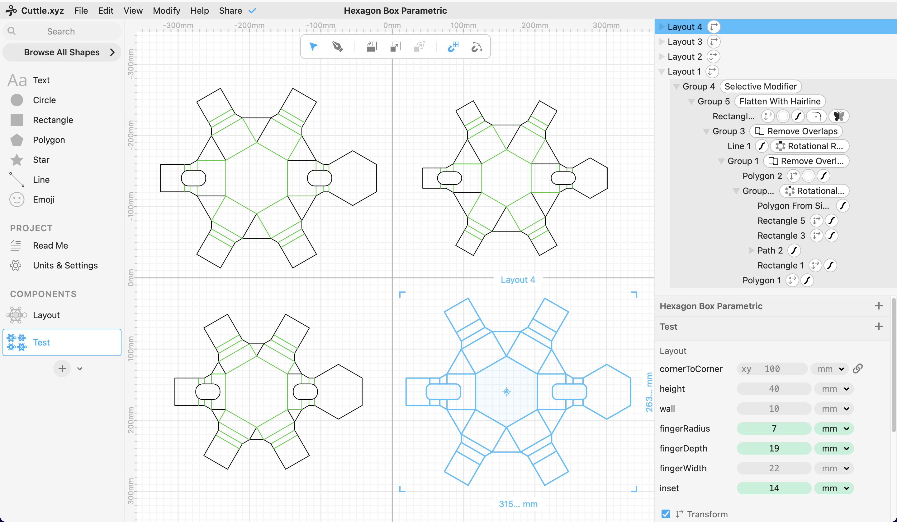

I'm on the small team building [Cuttle.xyz CAD for makers](https://cuttle.xyz). Because of this, it is the parametric design workflow that I'm most comfortable with. This week I learned to basics of a handful of 3D CAD software, and I wanted to end the week with a [physical object](cardboard-aided-design.md).

Cuttle.xyz interface, showing the same component as four instances with different parameters.

Using parameters in Cuttle is different than the constraint-based modelling in [SolveSpace](02-solvespace.md) and [FreeCAD](02-freecad.md). In Cuttle, parameters are emphasized in the interface, and there is not a concept of constraints. This means that to make shapes that a relative to each other, you have to do more math in the scale and position parameters of the shapes.

.

# Reference

* [Cuttle.xyz documentation](https://cuttle.xyz/learn/getting-started-with-scripting) and [videos](https://cuttle.xyz/learn/video-tutorials)
* [Laser cut cardstock workshop at Nordic Fablab Bootcamp](https://nordicfablabs.gitlab.io/nordic_fablabs_bootcamp_2024/workshops/cuttlexyz/) 2024
