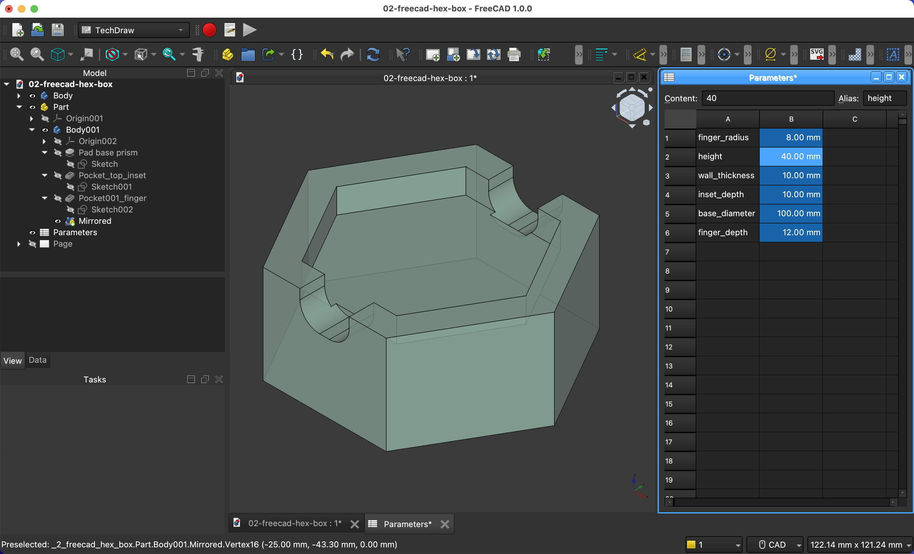
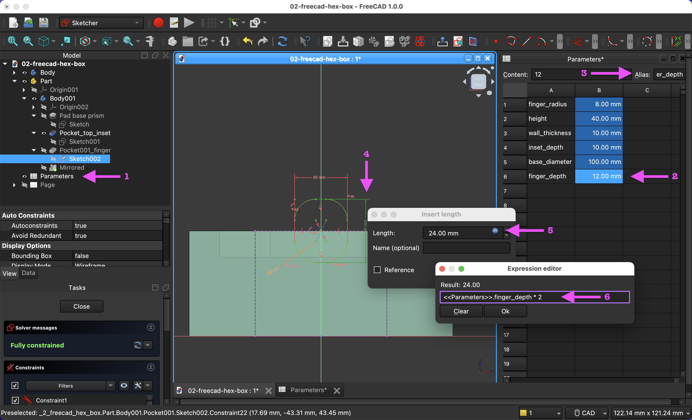
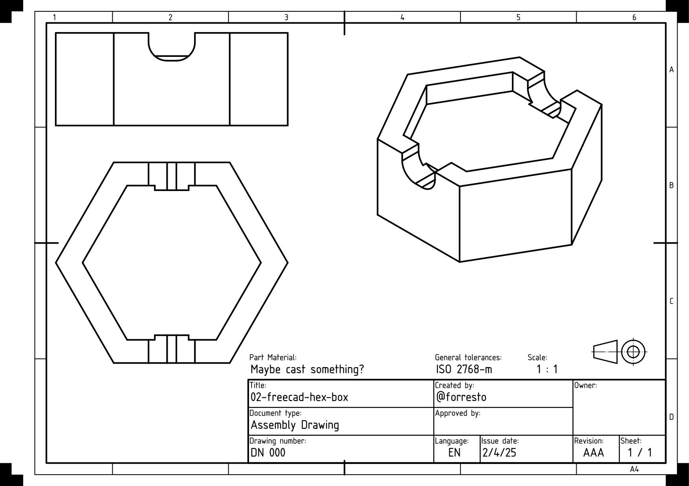

FreeCAD seems to be the OpenOffice of CAD, for better or worse.

It helped that I got comfortable with constraint-based modelling in SolveSpace earlier this week.

I did make this model parametric, but there are quite a few steps to adding and using a parameter.

1. Add a spreadsheet to the project
2. Add label and value columns the the spreadsheet
3. Duplicate labels as "Alias" for each value cell.
4. Open the constraint measurement that you want to set with the parameter.
5. Click the blue "function" icon by the value.
6. Add the parameter, with the format `<<SpreadsheetName>>.cell_alias`

😅

It seems like this process could be fewer steps / clicks. Setting up the windows to be able to edit the parameters while seeing the model is also more of chore than it should be. But I'll save my UX opinions for now.

# Result

"TechDraw" is a cool feature. I set this view up with an included ISO template in a few minutes. I might try drawing this with a pen plotter during CNC cutting week.

Project file: [02-freecad-hex-box.FCStd](02-freecad-hex-box.FCStd)
