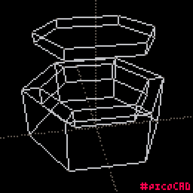

One more wildcard. [picoCAD](https://www.picocad.net) is built on the [PICO-8 fantasy console](https://www.lexaloffle.com/pico-8.php). What is a fantasy console? It's an answer to the question "what if NES had integrated developer tools and BBS?"

# Interface

The modeling experience is very manual. The options for adding geometry are limited to:

* Pyramid
* Prism
* Cube
* Pentagonal prism
* Hexagonal prism
* Cylinder (octagonal prism)
* Plane

The options to modify a mesh:

* Grow, shrink, rotate whole mesh
* Extrude face

There is no subdivision, or adding a vertex to an edge. All vertex positions are locked to a grid. My simple model required a sequence of extruding, scaling, and moving the top face of the hexagonal box. I tried making the finger cuts, but that went beyond my 8-bit CAD skills for today.

# Result

I like experimenting with this limited interface. The design is fully committed to authoring a specific kind of 3D pixel art. I might try using it with [Unfolder.app](https://www.unfolder.app) for papercraft design during computer controlled cutting week.
