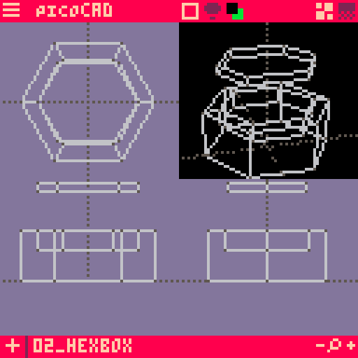

OK, one more wildcard. [picoCAD](https://www.picocad.net) is built on the [PICO-8 fantasy console](https://www.lexaloffle.com/pico-8.php). What is a fantasy console? It's an answer to the question "what if Nintendo had integrated developer tools and BBS?"

The modeling experience is very manual. The options for adding geometry are limited to:

* Pyramid
* Prism
* Cube
* Pentagonal prism
* Hexagonal prism
* Cylinder (octagonal prism)
* Plane

The options to modify a mesh:

* Grow / shrink mesh
* Extrude face

There is no subdivision, or adding a vertex to an edge. All vertex positions are locked to a grid. My simple model required a sequence of extruding, scaling, and moving the top face of the hexagonal box. I tried making the finger cuts, but that went beyond my 8-bit CAD skills for today.

I knew going into this that this will not have enough features to be the tool for my final project. I like experimenting with limited interfaces though. And I might try using it with [Unfolder.app](https://www.unfolder.app) for papercraft during computer controlled cutting week.
