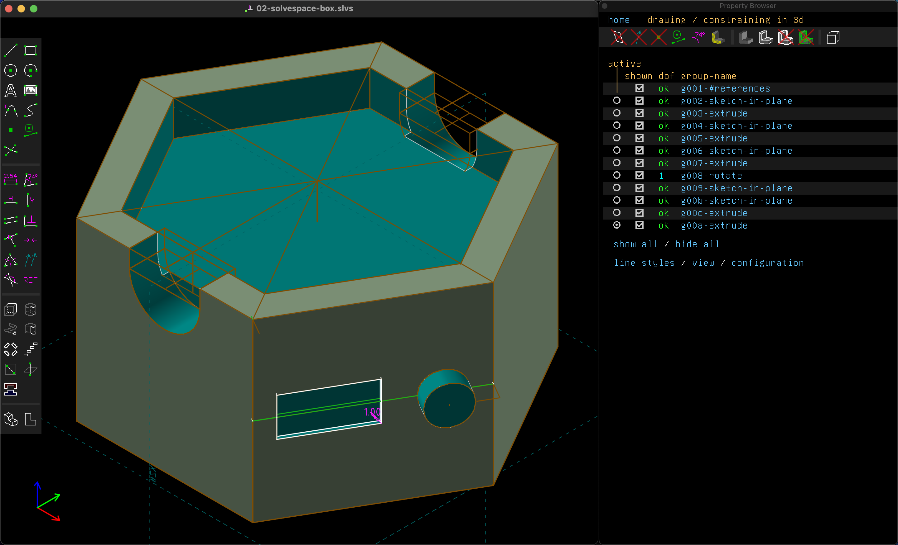

Kris introduced [SolveSpace](https://solvespace.com/) on Friday, and it started to click today after tinkering for a while.

# Result

<model-viewer src="02-solvespace-box.glb" ar ar-modes="webxr scene-viewer quick-look" camera-controls tone-mapping="neutral" poster="02-solvespace-box.glb-poster.webp" shadow-intensity="1">
</model-viewer>

# Geometric constraints

Using SolveSpace feels like a kind of geometry game, where you sketch a shape, then add constraints until the degrees of freedom goes to 0 ("dof ok") and the part is fully constrained. But look out, because if you add too many you'll end up with redundant constraints.

https://www.youtube.com/watch?v=wPk5TVY0cVo

This video shows the sketches, groups, and constraints to build up the part.

My first challenge was to make a hexagon.

...

# Questions

* Why are redundant constraints treated as an error?
* Is there a way to name specific distance constraints and view them in a list? It seems like I've done all the work to make a parametric model, but have to dive through the layers to change any parameters.

# Reference

* [SolveSpace](https://solvespace.com/)
* [SolveSpace keyboard shortcuts](https://defkey.com/es/solvespace-3-1-shortcuts)
