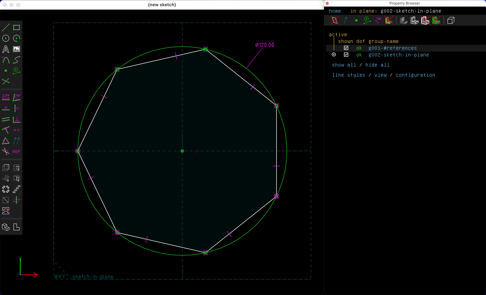

Kris introduced [SolveSpace](https://solvespace.com/) on Friday, and it started to click today after tinkering for a while.

# Result

<model-viewer src="02-solvespace-box.glb" ar ar-modes="webxr scene-viewer quick-look" camera-controls tone-mapping="neutral" poster="02-solvespace-box.glb-poster.webp" shadow-intensity="1">
</model-viewer>

3D model of the [music player concept](02-cad-comparison.md#sketch).

Design file: [02-solvespace-box.slvs](02-solvespace-box.slvs).

https://www.youtube.com/watch?v=wPk5TVY0cVo

This video shows the sketches, groups, and constraints that build up my part.

# Constraint-based design

Using SolveSpace feels like a kind of geometry game, where you sketch a shape, then add constraints until the degrees of freedom goes to 0 (`dof ok`) and the part is fully constrained. But look out, because if you add too many you'll end up with redundant constraints.

The first challenge with my design was to make a hexagon. I tried a few ways to construct this, but later saw a tutorial with a straightforward way.

1. Sketch circle (shortcut "c")
    * `dof 1` (meaning you can change the diameter)
    * Give the circle a diameter ("d")
    * `dof ok` (fully constrained)
2. Select circle and make it a construction reference ("g")
    * It turns green
3. Draw a chain of 6 segments around the circle ("s" for each segment)
    * `dof 6` (you can drag the ends around the circle)
4. Select pairs of segments and give them equal length constraints ("q")
    * According to the tutorial video, a future version will allow selecting all of the segments and making them equal at once. This doesn't work with my current version. 👈
    * `dof 1` (you can rotate the hexagon around the circle.)
5. Select a point of the hexagon and the X axis, add "point on plane" constraint ("o"), `dof ok`

Now the drawing is fully constrained, and you can change the diameter measurement to change the diameter of the hexagon.

To show that these steps generalize to other polygons, a heptagon.

https://www.youtube.com/watch?v=vBNAIMiomls&t=1827s

Paul Lutus' tutorial video, skipped to the "threaded bolt" section that starts with the hexagon.

# Questions

* Is there a way to name specific distance constraints and view them in a list?
* Why isn't there a built-in polygon definition? (Even [picoCAD](02-picocad.md) has hex. prism as a built-in shape. 😅)
* Is there a way to define one's own reusable sketches or parts?
* Why are redundant constraints treated as an error?

# Conclusion

I appreciate that SolveSpace.app is small, 29 MB on my machine. It starts and runs fast. I like the minimal vector aesthetic, and the general feel of the app. I can imagine it being useful to design quick, exact parts.

It doesn't seem to bridge the gap from constraint-based to parametric modeling. It seems like I've done all the work to make a parametric model, but have to dive through the layers to change any of the dimensions. It would be helpful to expose some of the dimensions as parameters. That would be a step towards making a library of reusable parts.

By getting a feel for different CAD software I'm starting to understand different ways of thinking about geometry. I've been working on [Cuttle](https://cuttle.xyz) for 4 years now, and design in that app is limited to the parametric 2d methods that we made it for. Learning other apps is mind-expanding, like parallel universes.

# Reference

* [SolveSpace](https://solvespace.com/)
* [SolveSpace keyboard shortcuts](https://defkey.com/es/solvespace-3-1-shortcuts)
