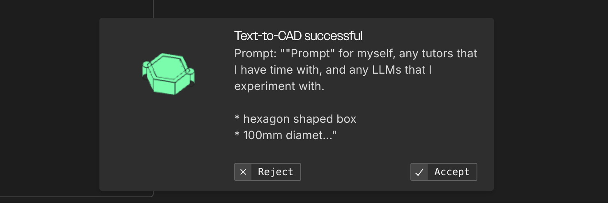
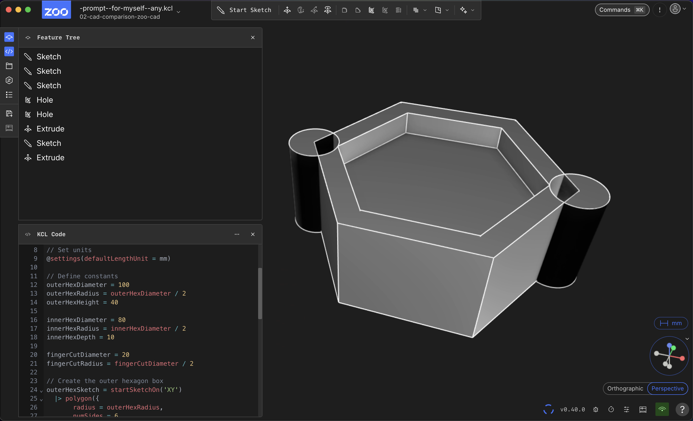
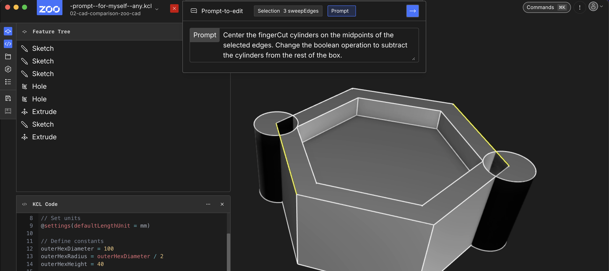
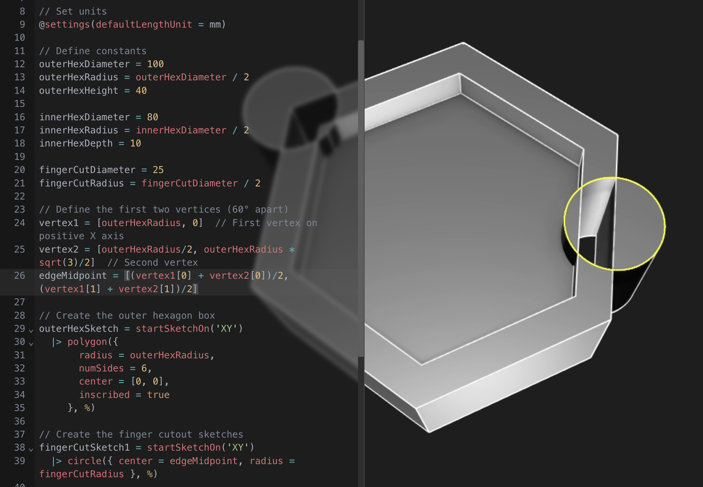

https://zoo.dev/modeling-app

![Welcome to Modeling App! This is a hardware design tool that lets you edit visually, with code, or both. It's powered by the KittyCAD Design API, the first API created for anyone to build hardware design tools. The 3D view is not running on your computer, but is instead being streamed to you from an instance of our Geometry Engine on a remote GPU as video. This is an alpha release, so you will encounter bugs and missing features. You can read our expectations for alpha users here, and please give us feedback on your experience our Discord! We are trying to release as early as possible to get feedback from users like you. As you go through the onboarding, we'll be changing and resetting your code occasionally, so that we can reference specific code features. So hold off on writing production KCL code until you're done with the onboarding](02-zoo-streaming-warning.png)

Warning that the view isn't actually on your computer, it is streaming from a cloud GPU. This is going to need to be really compelling for me to invest too much time into leaning.

# "Text-to-CAD" Prompt

> * hexagon shaped box
> * 100mm diameter
> * extrude to 40mm height
> * top has inset hexagon with 80mm diameter and 10mm depth
> * two opposing edges have place for fingers subtracted, pills or spheres with 20mm diameter

Starting from nothing, I thought I'd see if the "text-to-CAD" feature can show a good starting place. It is the ✨ icon on the top toolbar.



Let's see about that. The tiny icon is 50% encouraging, 50% glitchy.

## Result

Here is the code and image that it came up with. Color me mildly impressed.



The cutouts are on corners, and didn't do the correct Boolean, but the parameters in code do seem like a decent starting place, considering that I have no experience or instruction with the app.

I do have enough design experience to have written a fairly specific prompt for the object that I have sketched. Sketching helped me think about the geometry construction at a high and manual level. Pencil and pen aided design.

## Generated code

```kcl
/* Generated by Text-to-CAD: hexagon shaped box
 * 100mm diameter
 * extrude to 40mm height
 * top has inset hexagon with 80mm diameter and 10mm depth
 * two opposing edges have place for fingers subtracted, pills or spheres with 20mm diameter
 */

// Set units
@settings(defaultLengthUnit = mm)

// Define constants
outerHexDiameter = 100
outerHexRadius = outerHexDiameter / 2
outerHexHeight = 40

innerHexDiameter = 80
innerHexRadius = innerHexDiameter / 2
innerHexDepth = 10

fingerCutDiameter = 20
fingerCutRadius = fingerCutDiameter / 2

// Create the outer hexagon box
outerHexSketch = startSketchOn('XY')
  |> polygon({
       radius = outerHexRadius,
       numSides = 6,
       center = [0, 0],
       inscribed = true
     }, %)

// Create the finger cutout sketches
fingerCutSketch1 = startSketchOn('XY')
  |> circle({ center = [outerHexRadius, 0], radius = fingerCutRadius }, %)

fingerCutSketch2 = startSketchOn('XY')
  |> circle({ center = [-outerHexRadius, 0], radius = fingerCutRadius }, %)

// Subtract the finger cutouts from the outer hexagon sketch
outerHexWithHolesSketch = outerHexSketch
  |> hole(fingerCutSketch1, %)
  |> hole(fingerCutSketch2, %)

// Extrude the outer hexagon with holes
outerHex = extrude(outerHexHeight, outerHexWithHolesSketch)

// Create the inset hexagon on top
innerHexSketch = startSketchOn(outerHex, 'end')
  |> polygon({
       radius = innerHexRadius,
       numSides = 6,
       center = [0, 0],
       inscribed = true
     }, %)

innerHex = extrude(-innerHexDepth, innerHexSketch)

// The final box is the outer hexagon with the inner hexagon cutout
finalBox = outerHex
```

# "Prompt-to-Edit"

Also under the ✨ icon.

> Center the fingerCut cylinders on the selected edges. Change the boolean operation to subtract the cylinders from the rest of the box.



> Failed to edit your KCL code, please try again with a different prompt or selection

:sad-trombone:

> move fingerCutSketch1 to midpoint of hexagon edge

:sad-trombone:

OK that's not really working with my level of this app.

# Attempt to tinker with the code

This is the point where I'd love to ask a question of an expert. What's the first step in this situation?

I can add this point definition to get the position of the first hole.

```kcl
// Define the first two vertices (60° apart)
vertex1 = [outerHexRadius, 0]
vertex2 = [outerHexRadius/2, outerHexRadius * sqrt(3)/2]
// Midpoint of those points is the average
edgeMidpoint = [(vertex1[0] + vertex2[0])/2, (vertex1[1] + vertex2[1])/2]
```

Would be better with [vector operator overrides](https://xoxo.zone/@forresto/113865294623578977) but I can look into that if this app sticks.



It moved to the right place, centered on the edge. 🎉

The Boolean subtraction (`hole()`) seems like it is done in the wrong place in the code.

# App feel

Learning the canvas navigation is not helped by the streaming lag. My mouse wheel zooms too fast and the model escapes behind me. Hovering and selections take moments too long.

I've been enamored with SolveSpace and OpenSCAD, which have small executables and feel very responsive. I can't imagine taking the tradeoff to develop and app to render with Cloud GPUs, but I guess they have reasons.

I'd encourage the developers of Zoo to try these other apps. Blender isn't small, but it feels very responsive. Local software people!

(Disclosure: I work on [web-based 2D CAD](https://cuttle.xyz), which is not local. But the rendering is local.)

# Claude chat with this blog post.

I'm taking these notes in [Zed](https://zed.dev) which has access to Claude 3.5 Sonnet in a sidebar. It's interesting to feed in my own blog post as I'm figuring stuff out, and see if it can be of help. As always, it hallucinates specifics, but can be helpful for high-level planning.

<blockquote>

You

See my diff and further comments

> content/fab-academy/02-zoo-modeling-app.md

Assitant

Yes, after your experiment with moving the holes, ~~I see that `rotate2d()` would be cleaner than my previous suggestion. Let me refine the approach:~~

...

And you're right about the Boolean operation - looking at the original code, the `hole()` operations are being done on the 2D sketch before extrusion, when they should probably be 3D operations. The holes should go all the way through the box, not just cut the base sketch.

To fix this, we should:
1. Extrude the base hexagon first
2. Create and extrude the finger cut cylinders
3. Use 3D Boolean subtraction to remove the cylinders from the box

Would you like me to show how to restructure the code to do the Boolean operations in 3D instead of 2D?

I also appreciate your comments about local vs cloud CAD. The latency issues you're experiencing with navigation and selection are significant usability concerns that don't exist with local rendering.

</blockquote>

Note: `rotate2d()` for KCL is Claude's hallucination.
