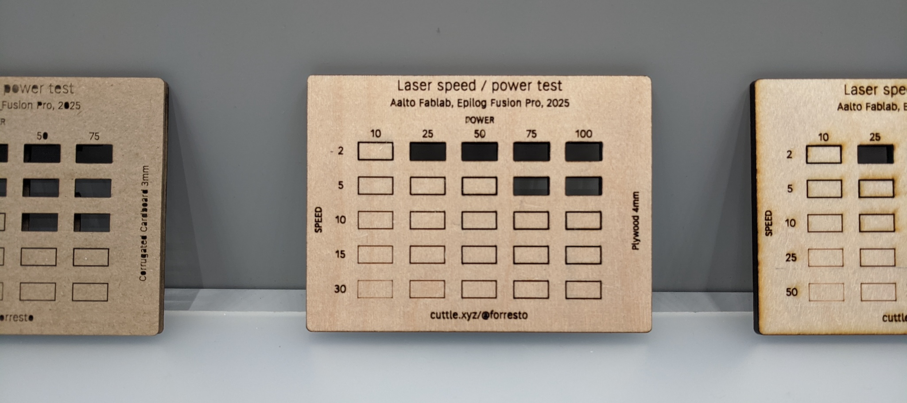

# Group work

The group work for the week was to do some test cuts to characterize the realationship of the speed and power settings on the laser cutter. I'm a group of one, building on last year's group work.

## Laser speed and power test cut matrix


Parametric colors for the grid of rectangles.


By making the labels parametric, I was able to make testers for different materials without changing the design. I used a pattern with the paramters that each line of the text input becomes a label. Cuttle supports JavaScript in the parameters, so I made derived parameters like this: 

```js
_powers = powers.split("\n")
_speeds = speeds.split("\n")
```

This makes arrays of strings, one for each label. Then in the **Linear Repeat** modifier, I select "customize each repetition" which makes a `rep` index variable in the context of the repear modifier. In the label text I add the expression `_powers[rep]`. 

All of this scripting is hidden away in the packaged view, when I make the design public on Cuttle.xyz.


Design source: [Cuttle Parametric Laser Tester](https://cuttle.xyz/@forresto/Laser-Tester-yTS7qaH2wYmv).

## Laser testing

Aalto Fablab's laser cutter is an Epilog Fusion Pro. It had some maintenance the day before. It is nominally 80w, but the tube is well-loved and according the the folks that did the maintenance it is closer to 35w now. So it is due for a tube replacement.


Since the machine was recently serviced, it was interesting to compare to last year's test cuts. The results are very similar.



Note that my 4mm plywood had masking tape applied, so this photo doesn't show the smoke marks that would have been present. I have not been able to avoid charing and smoke marks while using this machine with plywood. 

When the tube is replaced I can redo these tests with the same parameters, and compare the results.

## Tiny fire

I made my first fire with the laser cutter. While doing the cardboard test cut, the rectangle with the least speed and most power had a small fire on the back of the material. It put itself out fast enough that it did not reach the front of the material, so I didn't notice until I removed it from the machine.

Since cardboard cuts well at 20s 50p, there is no reason to use 5s 75p! ⚠️
