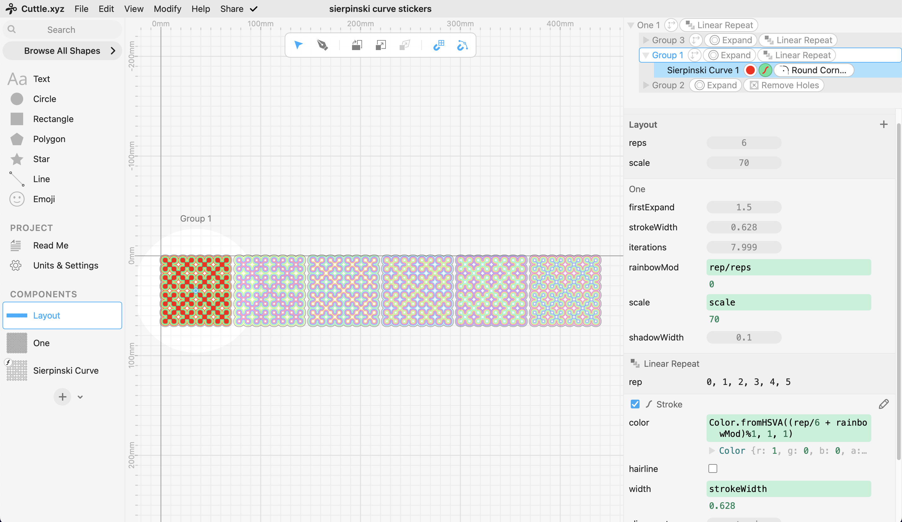
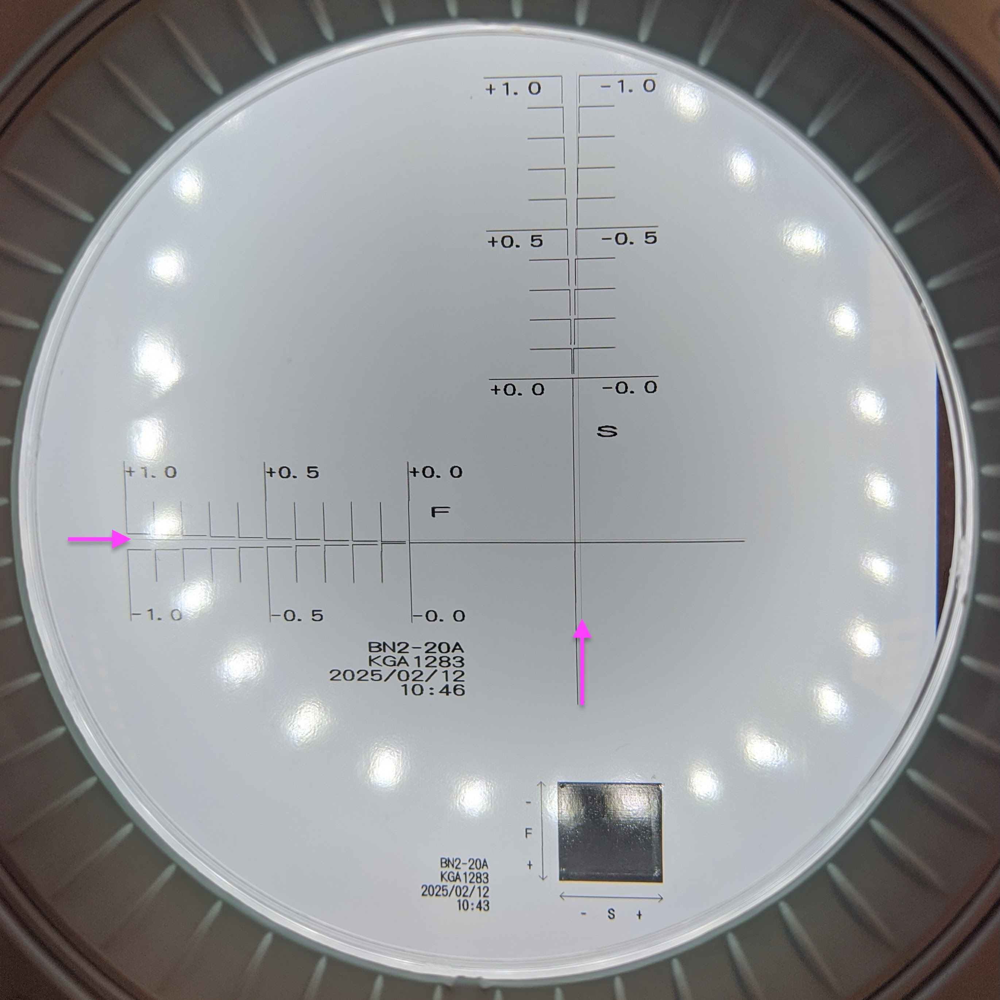

# CNC Cutting


Roland VersaSTUDIO BN2-20A print and cut machine. This machine is new to me and Aalto Fablab, and I wanted to learn the basics of the print and cut workflow.

## Sticker Design

The Sierpinksi curve is a shape that I've come back to many times, both analog and code. Here's [an animated version](https://observablehq.com/@forresto/sierpinski-curve-animation), and here's one made by [walking in the snow](https://www.youtube.com/watch?v=UCET30r5E2I).



In Cuttle, I started from [a code component](https://cuttle.xyz/@forresto/Sierpinski-Curve-3zoTtoI5Ev8n) that creates the basic curve. Then I stacked modifiers to expand the curve by different amounts, and color the strokes. 

## Sticker Cutting


First cut looked OK, but the cut and print calibration was a little off.



Roland calibration tester. Vertical and horizontal gauges show how much to change.


Second print showing that the print and cut calibration is fixed.

## Open Questions


I was suprised that it printed the magenta of the cut lines. I couldn't find an option that would disable printing those cut lines. For the second design, I reduced the cut stroke width to 0.001pt, which mostly solved the issue. The same question [without a clear answer from r/CommercialPrinting](https://www.reddit.com/r/CommercialPrinting/comments/1bp5ude/need_help_making_versaworks_stop_printing_cut/).

# Construction Kit

I made a modular origami part known as _Francis Ow's 60 Degree Unit_. These have ratios that make it easy enough to fold by hand, but by using Cricut to cut and score my material I saved some time, and ended up with very accurate parts.


## Kit Design


I took advantage of Cuttle's parameters and modifiers to make the cut and score lines. 


I also brought the design into [Origami Simulator](https://origamisimulator.org) to check my angles, which helped me correct a trigonometry issue before cutting.


This is as far as I got with the [Five Intersecting Tetrahedra](http://origametry.net/fit.html) construction. It is quite a puzzle! 

If I do this again I'll redesign the parts to be better for cardstock, or use lighter paper.

> Side quest: [modeling FIT in OpenSCAD, with 3D steps](https://www.forresto.com/2020s/fit.html).

# Group work

The group work for the week was to do some test cuts to characterize the realationship of the speed and power settings on the laser cutter. I'm a group of one, building on last year's group work.

## Laser speed and power test cut matrix


Parametric colors for the grid of rectangles.


By making the labels parametric, I was able to make testers for different materials without changing the design. I used a pattern with the parameters that each line of the text input becomes a label. Cuttle supports JavaScript in the parameters, so I made derived parameters like this: 

```js
_powers = powers.split("\n")
_speeds = speeds.split("\n")
```

This makes arrays of strings, one for each label. Then in the **Linear Repeat** modifier, I select "customize each repetition" which makes a `rep` index variable in the context of the repeat modifier. In the label text I add the expression `_powers[rep]`. 

All of this scripting is hidden away in the packaged view, when I make the design public on Cuttle.xyz.


Design source: [Cuttle Parametric Laser Tester](https://cuttle.xyz/@forresto/Laser-Tester-yTS7qaH2wYmv).

## Laser testing

Aalto Fablab's laser cutter is an Epilog Fusion Pro. It had some maintenance the day before. It is nominally 80w, but the tube is well-loved and according the the folks that did the maintenance it is closer to 35w now. So it is due for a tube replacement.


Since the machine was recently serviced, it was interesting to compare to last year's test cuts. The results are very similar.


Note that my 4mm plywood had masking tape applied, so this photo doesn't show the smoke marks that would have been present. I have not been able to avoid charing and smoke marks while using this machine with plywood. Do we need to tweak the air assist? When I sent stuff out to a professional shop, the edges look almost caramalized, as opposed to charred. That would be nice.

When the tube is replaced I can redo these tests with the same parameters, and compare the results.

## Tiny fire


I made my first fire with the laser cutter. While doing the cardboard test cut, the rectangle with the least speed and most power had a small fire on the back of the material. It put itself out fast enough that it did not reach the front of the material, so I didn't notice until I removed it from the machine.

Since cardboard cuts well at 20s 50p, there is no reason to use 5s 75p! ⚠️
