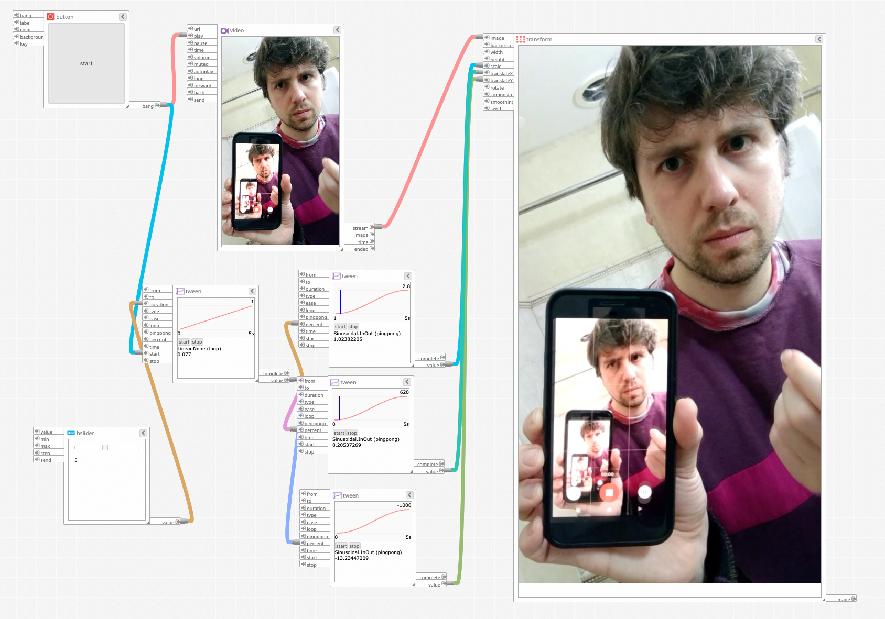

Meemoo jam...

https://app.meemoo.org/#gist/35e3b45b5fb0ab1e0625c4410da841050
(I need to make a URL for the video file.)
(I should make an auto-embedder for Meemoo URLs.)

I made this in "IX2" the interaction system in Webflow, c. 2019. Today I remade the composition in Meemoo, and I liked tweaking the numbers like this, with stacked tweens. The video loop and the scale and translation loops are independent.

All of my recent practice in Blender Geometry Nodes has helped me to understand Meemoo's data flow in a deeper way. I wish Blender's interface had more debug views like Meemoo. You can drag any of the tweens to scrub the values, or leave it looping and tweak stuff as you go. You can do some of that in Blender, but the debug views are limited, and the node view is mostly static.

I remember @Barrett's reply to the Webflow build, something like "jeez man."

I agree.
