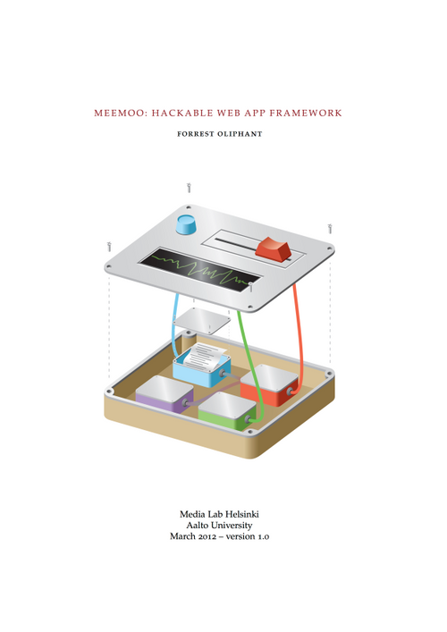

# Meemoo Thesis

[Meemoo.org](http://meemoo.org/) started as my MA thesis project at [Media Lab Helsinki](http://medialab.aalto.fi/), Aalto University, Helsinki Finland. The project is ongoing. I submitted the written portion of the project on March 20, 2012:

* [Read online](http://issuu.com/forresto.com/docs/forrestoliphant-meemoothesis?e=9748257/5445934)
* Download PDF: [screen](https://github.com/forresto/thesis-design-for-hackability/releases/download/1.0.0/ForrestOliphant-MeemooThesis-web.pdf) (1.6 MB) or [print](https://github.com/forresto/thesis-design-for-hackability/releases/download/1.0.0/ForrestOliphant-MeemooThesis.pdf) (18.2 MB)
* National Library of Finland identifier: [URN:NBN:fi:aalto-201206102286](http://urn.fi/URN:NBN:fi:aalto-201206102286)
